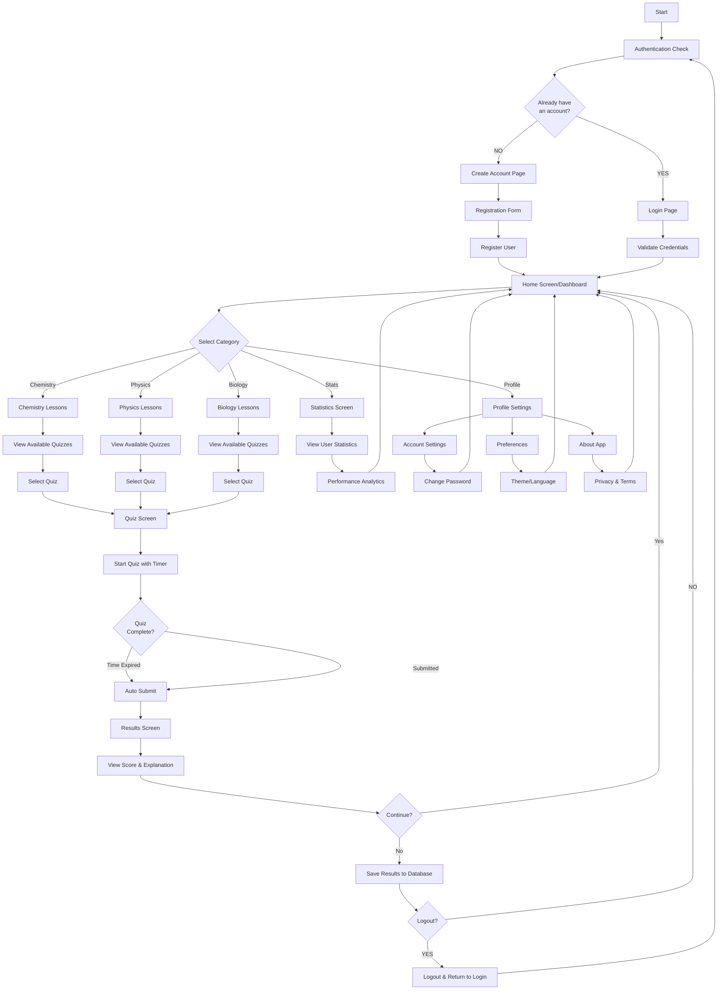

# Educational Quiz App - Flow Diagram

## Features in Your App:

### **Authentication Flow:**
- ✅ Create Account → Register User
- ✅ Login → Validate Credentials

### **Main Dashboard (3 Tabs):**
1. **Quizzes Tab** → Subjects (Chemistry/Physics/Biology) → Lessons → Quizzes
2. **Statistics Tab** → Performance metrics
3. **Profile Tab** → Settings & Account management

### **Quiz Flow:**
- ✅ Start Quiz with Timer (countdown display)
- ✅ Auto-submit on time expiry or manual submit
- ✅ View Results with score
- ✅ Save Results to Firebase

### **Profile Settings:**
- Account settings
- Preferences (theme/language)
- About section

---

## To Create a Visual Diagram Online:

### **Option 1: Mermaid Live (Free)**
Paste this diagram at: https://mermaid.live/

### **Option 2: Draw.io (Free)**
1. Go to https://draw.io/
2. Create new diagram
3. Recreate manually with shapes

### **Option 3: Lucidchart**
https://www.lucidchart.com/ (Free tier available)

---

## Next Steps:
Would you like me to:
1. ✅ **Refine the diagram** with more details?
2. ✅ **Add database interactions** (Firebase storage)?
3. ✅ **Create UML class diagrams** for your models?
4. ✅ **Generate this as PNG/SVG** for documentation?
